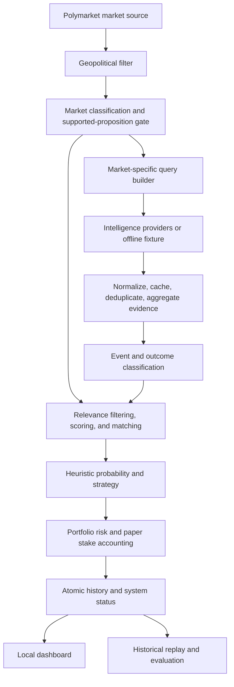

<!-- File-Version: 1.5.0 -->
# PolymarketBot

PolymarketBot is an explainable Python system for analysing a supported subset
of geopolitical prediction markets. It combines prediction-market data with
normalized external evidence, applies deterministic rule-based classification
and relevance matching, generates heuristic probability estimates and
simulated YES/NO decisions, and records explainable paper results for inspection
through a local dashboard.

The repository also contains historical collection, replay, and evaluation
tooling designed around reproducibility, resumable collection, timestamp
provenance, and prevention of future-data leakage.

This is a software-engineering and research project: it uses rule-based NLP,
not an LLM; produces paper decisions, not live trades; and makes no claim of
profitability or calibrated predictive performance.

## What it demonstrates

- Modular market and intelligence-provider boundaries for Polymarket Gamma,
  GDELT, RSS, ReliefWeb, Media Cloud research archives, and offline fixtures.
- Normalization of external reports into shared event models with provider,
  publisher, publication-time, availability-time, and source provenance.
- Deterministic rule-based market, event, outcome, entity, and topic
  classification with a deliberately narrow supported-proposition gate.
- Proposition-aware relevance filtering, evidence scoring, market matching,
  same-publisher deduplication, and independent-source aggregation.
- Explainable heuristic probabilities and YES/NO paper decisions with recorded
  scores, match reasons, confidence, edge, and risk rationale.
- Fail-closed validation for malformed market prices, unsupported propositions,
  unsafe persistent state, and invalid settlement inputs.
- Consistent stake accounting: `position_size` is the fraction of normalized
  portfolio capital staked on the selected side.
- Atomic JSON persistence, corruption detection, runner/provider status, and a
  read-only local monitoring dashboard.
- A deterministic offline integration demo that exercises the production
  pipeline without credentials or network access.
- Resumable historical collection with checkpoints, retry queues, partition
  manifests, SHA-256 integrity checks, and explicit coverage/readiness gates.
- Timestamp-aware replay, causal event clustering, publisher-aware independent
  confirmation, cluster-safe chronological splits, Brier score, and log-loss
  evaluation.
- Automated regression testing and GitHub Actions CI on Python 3.10 and 3.13.

## Architecture



Live providers and the offline fixture share the same downstream models and
pipeline. The fixture adapters supply raw deterministic inputs; they do not
construct final decisions or duplicate the production algorithms.

## Quick start: deterministic offline demo

The offline demo is the primary way to explore the project. It requires Python
3.10 or newer, uses tracked fixture inputs, performs no network calls, and does
not require an `.env` file.

From a fresh clone:

```bash
git clone https://github.com/WikiPoah/polymarket-bot.git
cd polymarket-bot
python3 -m venv .venv
source .venv/bin/activate
python -m pip install --upgrade pip
python -m pip install -r requirements-dev.txt
```

Run the real pipeline against the deterministic fixture:

```bash
python -m src.demo
```

The demo loads four raw markets and five provider-style evidence records. It
filters one sports market, rejects one explicitly negated proposition, produces
one accepted `BUY YES` paper decision, and ignores one opportunity whose edge
is below the strategy threshold. It safely recreates only:

```text
data/demo_run/paper_trading_history.json
data/demo_run/system_status.json
```

Inspect the generated JSON if desired:

```bash
python -m json.tool data/demo_run/paper_trading_history.json
python -m json.tool data/demo_run/system_status.json
```

Start the dashboard with both generated files:

```bash
python -m src.dashboard \
  --history data/demo_run/paper_trading_history.json \
  --status data/demo_run/system_status.json
```

Open `http://127.0.0.1:8080`. The dashboard shows the decision funnel,
accepted and ignored ideas, rationale and evidence, paper outcomes, provider
freshness, and runner status. Press `Ctrl+C` to stop it.

Run the verification suite:

```bash
python -m pytest -q
python -m ruff check .
```

On Windows PowerShell, activate the environment with
`.venv\Scripts\Activate.ps1`; the remaining `python -m ...` commands are the
same.

## Live paper-evaluation mode

Live mode fetches active markets from the public Polymarket Gamma API and
queries configured intelligence providers. It records paper decisions only and
contains no order-placement integration.

Copy the environment template and provide only credentials or identifiers you
are authorized to use:

```bash
cp .env.example .env
python -m src.main
```

| Setting | Use |
| --- | --- |
| `GDELT_API_KEY` | GDELT Cloud intelligence retrieval |
| `RELIEFWEB_APPNAME` | Exact ReliefWeb-approved application identifier |
| `MEDIA_CLOUD_API_KEY` | Optional historical Media Cloud collection |
| `MEDIA_CLOUD_COLLECTION_IDS` | Media Cloud collection selection |

RSS feeds are configured in `src/config.py`. Provider authorization, schemas,
rate limits, and availability can change; failures are recorded and isolated
where possible. Continuous paper evaluation is available with
`python -m src.main --interval 300`, and diagnostic logging with
`python -m src.main --log-level DEBUG`.

Live runtime histories and status files are local, ignored JSON artifacts under
`data/`. The dashboard can read them with its default paths via
`python -m src.dashboard`.

## Historical collection and evaluation

The historical subsystem is implemented engineering infrastructure, not a
completed performance benchmark. It provides:

- frozen market universes and provider/day partition manifests;
- SHA-256 checks for frozen universe and collection-plan integrity;
- atomic stores, durable checkpoints, bounded retries, cooldowns, resumable
  pagination, and explicit incomplete/failed/excluded states;
- separate `published_at` and provider-derived `available_at` provenance;
- stable provider, publisher, record, story, and causal event identities;
- conservative causal clustering and publisher-aware independent confirmation;
- replay that exposes only evidence and prices available at each historical
  timestamp;
- chronological splits that keep related market/event clusters together;
- Brier score, log loss, calibration/composition diagnostics, and readiness
  gates for price coverage, provider completeness, leakage, sample size, event
  clusters, categories, and split viability.

Collection output and large raw archives are intentionally excluded from Git.
A fresh clone contains the evaluation code and tests, but not the local
historical datasets required to reproduce the larger pilot numbers. Inspect an
existing local collection without making requests with:

```bash
python -m src.historical_dataset \
  --output-dir data/historical_selection_2026-02_to_2026-08 \
  --intelligence-status
```

Coverage and evaluation commands for an available local dataset are:

```bash
python -m src.evaluation.coverage --dataset-dir <dataset-directory>
python -m src.evaluation --dataset-dir <dataset-directory> --generate-only
```

The current research record documents incomplete provider coverage and treats
all reported pilot metrics as diagnostic, not as model-selection or
profitability evidence: [historical benchmark dataset audit](research/2026-08-12-historical-benchmark-dataset-audit.md).

## Testing and CI

The regression suite covers market pagination, provider normalization,
classification boundaries, unsupported propositions, evidence relevance and
deduplication, probability validation, BUY YES/BUY NO sizing, portfolio risk,
stake settlement, persistence corruption, deterministic demo behavior,
historical checkpoints, temporal leakage protection, causal clustering,
forecast metrics, and readiness gates.

At this final presentation pass, the full suite contains 285 passing tests.
GitHub Actions runs Ruff and the complete pytest/coverage suite on Python 3.10
and 3.13 for every push and pull request; the executable suite, rather than the
stated count, is the source of truth.

## Repository layout

```text
src/api.py                 Polymarket Gamma client
src/demo.py                official deterministic offline demo
src/intelligence/          providers, normalization, classification, matching
src/strategy/              probabilities, expected value, sizing, risk
src/paper_trading/         persistence, analytics, backtesting, replay
src/dashboard/             local read-only monitoring dashboard
src/evaluation/            clustering, observations, splits, metrics, readiness
src/historical_dataset.py  resumable historical collection and validation
tests/                     unit and integration regression suite
data/demo_fixture.json     tracked deterministic raw demo inputs
research/                  reproducible investigations and limitations
```

## Limitations

- No live trading or order execution is implemented.
- No profitability claim is made; accepted demo decisions are unresolved paper
  examples, not evidence of predictive success.
- Probability estimates and thresholds are deterministic heuristics, not
  calibrated forecasts or machine-learned models.
- Classification is rule-based NLP over a deliberately narrow proposition
  grammar and supported set of geopolitical entities and event types.
- Historical provider collection and benchmark coverage remain incomplete;
  current pilot results are unsuitable for estimator tuning or performance
  claims.
- Historical bid/ask spread, order-book depth, liquidity, fill probability,
  fees, and slippage are unavailable or incomplete, depending on the source.
- Live external providers can change schemas, authorization, rate limits, or
  availability.
- The dashboard is a local operational/review interface, not a hardened public
  web application.
- JSON persistence is intentional for this project scope. It is atomic and
  corruption-aware but is not a multi-user transactional database.

## Safety and disclaimer

This repository is for software-engineering demonstration, research, and paper
analysis. Prediction markets involve financial and legal risk. Generated
probabilities and decisions are not financial advice and should not be connected
to real execution without independent validation, controls, and legal review.
